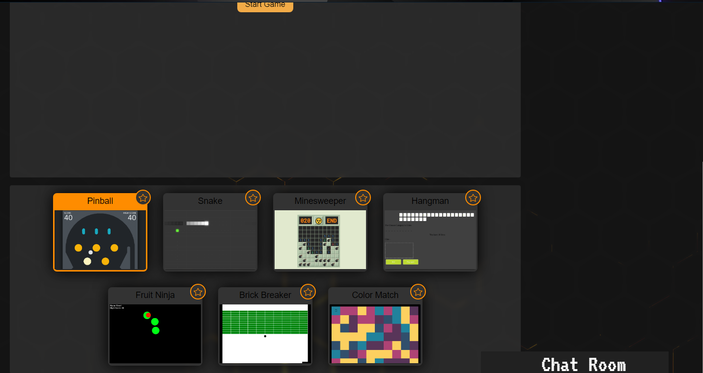

# Level Up

  ## Link to Deployed Website
  
  https://garden-boys-missing-their-popp.herokuapp.com/

  ## Link to Presentation

  https://drago9082.github.io/Level-Up-Reveal.js/
  Presentation Repo Link: https://github.com/Drago9082/Level-Up-Reveal.js

  ## Table of Contents

  - [Preview](#preview)

  - [Usage](#usage)

  - [Technologies](#technologies)

  - [Credits](#credits)

  - [License](#license)

  - [Contact Us](#contact)
  

  ## Description
  
  With this website, users can play a wide variety of mini-games and if they register an account and login, then they can also save their favorite games to play at a later time.  They can also compare their scores with other gamers using a chat available on the website.

 ## Usage
1. The landing page will take you to the main screen with a random game ready to play, more games can be found at the bottom of the screen.  There is a register and login on the navbar to use.  Users can play the games without logging in.
2. Once registered and logged in, users can also favorite their preferred games.
3. Users can also use and integrated chatbox to communicate with other gamers.

  ## Preview

  
  
  
  
 
  
  ## Technologies

  - Axios
  - Node.js
  - Express
  - Socket.io
  - React
  - MongoDB
  - React-Bootstrap
  - Reveal.js
  - jQuery

  ## Credits
  
  Odis Clemons, Rajiv Tiwari, Donaldson Roessling, Jordan Stone
  

  ## License
  
  
  

  ## Contact
  
  #### Odis Clemons
  Github: https://github.com/odisclemons

  #### Rajiv Tiwari
  Github: https://github.com/Drago9082/

  #### Donaldson Roessling
  Github: https://github.com/Droessling94

  #### Jordan Stone
  Github: https://github.com/jkstone321
